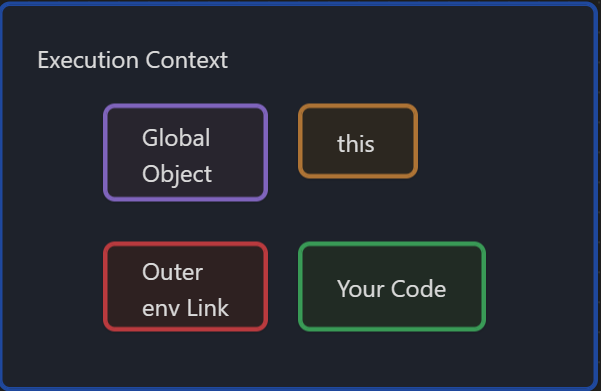

# JavaScript (Understanding the weird parts)

- Lexical Environment

- Execution context:

  - Section of code that is running  

- Object is a collection of name value pairs.

Execution context (Global):

  base execution context (accessible everywhere)

    - it creates a global object and a special variable `this`

  `Window` object is the global object in case of a browser
  


 
    - In js when you create a variable or a function, if it is not inside a function, it gets attached to the global object. (Lexically if not inside a function, it is inside the global object)

- Link to the outer environment

## Hoisting

- Execution context is created in two phases
  - creation phase:
    global object, this, outer environment
    sets up memory space for variables and functions (hoisting)

    when the code begins to execute the js engine has already set aside memory space for the variables and functions, functions in their entirety (with the code definition inside them) is placed in memory during the creation phase, this is not the case with variables.

    Only during execution phase the assignments and function calls take place.

    variables during creation phase are set to a placeholder when it sets up memory space. (undefined)

    All variables in js are initially set to undefined.

    *Don't rely on hoisting*

    undefined is a special value in JS (keyword)

    it's a value that variables receive during the creation phase (1st phase of creating an execution context)

  - execution phase:

    executes the code line by line. Variable assignments and function calls happens during this phase.

## Single threaded synchronous execution

  
    - Single threaded:

      one command is being executed at any given time.

    - Synchronous:

      one at a time and in the order that it appears

```javascript
function b() {

}
function a() {
	b();
}
a();
```
  

   here initially the global execution context is created with thee global object (window in browsers or global if it is node), it sets up memory space for functions, places them entirely in memory. And during the execution phase when the line a(); is encountered it creates a different execution context (function execution context for function a) where it again goes through 2 phases (create and execute) and again when it encounters line b() during execution (function invocation of b) it creates another execution context for function b and does the same process for b as well.

    (`this` variable is created for each function)

    Every function creates a new execution context  

    when the function execution finishes, the execution context is popped off the stack.

  *Variable environments*

  *scope chains*, every execution contexts has a reference to its outer environment, not onky its variable environment but the reference/knowledge of the outer environment.

  *Scope* is where a variable is available in your code, and if truly the same variable or a new copy

  block scoping with `let`, same as `var` but the js engine won't allowed to use it until the line of code which sets it is not executed.

```javascript
console.log(a); // this will throw an error
// more specifically: Uncaught ReferenceError: Cannot access 'a' before initialization
let a = 10;
```

    its only available in the block

  Asynchronous: more than one at a time

  Event queues

    event queue wont be processed until the execution stack is empty
   
  JS engine periodically looks at the event queue in a loop called event loop, only when the execution stack is empty

  During the execution if present js will put stuff in the event queue, which will get processed in the background asynchronously outside of the javascript engine (by web api's present in the browser or other engines)

  Primitive type ==> something that isn't an object ==> its a single value.

  undefined ==> represents a lack of existence (don't use this, test for this is fine, let the engine set this)

  null == lack of existence. (you can use null to set for a variable)

  number ==> floating point always

  string ==> sequence of characters

  symbol ==> ES6

  boolean ==> true or false  

**Operators are functions**

prefix notation for operators +3 4

infix notation for operators 3 + 4 ==> js supports this (human readable)

it is like having a function `+` ==> function +(a, b) {  return // add numbers somehow } ==> invoke like +(3, 4)

Operator associativity ==> left to right or right to left associativity, the order in which the operators are executed. (what order the operator functions are called in) ==> used to break ties while executing operators which have same precedence / same priority

*Type coercion*

Converting a value from one type to another

. ==> member access

[ ... ] ==> computed member access  

functions are objects in javascript. (They are first class functions ==> everything you csn do with other types, you can do with functions)

function is an object and code is one of the properties of that object which is invocable

                                                          Function
                  primitive, object, Function, Name (optional it can be anonymous), Code (this is invocable with ())

Expressions are something that returns a value, evaluates into a value which may or may not be saved in a variable. (function expressions)

Statements don't evaluate into any value (example if statements and for loops, function statements)

Primitive types are referenced by value

var a = 10; // creates a memory space and puts 10 in it during execution phase

var b = a; // creates a separate memory space and puts a copy of the a there

a: 0x001 --> [ 10 ]

b: 0x002 --> [ 10 ]

// variables are just pointers or references to memory spaces where the actual value exists.

but if var a = {} // object and

var b = a;

now a and b points to same value in memory. (by reference)

a: 0x001
               ]--> {}
b: 0x001

no copy of the object is created

function calls are actually `window.foo() `(same as calling foo()) so the `this` keyword is attached/points to the window object. whereas if a method (a function inside a custom object) is called, the `this` keyword points to the custom object that contains the method.

inside of arrow functions the `this` keyword always points to the window object

but inside classes the `this` keyword points to the Class object itself always, even inside deeply nested arrow functions. But if we use a normal function (anonymous or otherwise using the `function` keyword) the `this` keyword will be undefined.

workarounds for `this` problem would be to use `let self = this;` or binding the outer this to the function using the `bind` method.

arguments is an array like object (its not technically an array as it does not have array methods)

automatic semicolon insertion

bind ==> will bind the `this` variable to whatever object we want and creates a copy of the function which can be invoked

call ==> does the exact same thing as bind but does not make a copy, it rather executes the function then and there, takes comma separated arguments along with the this reference as the first argument.

apply ==> same as call but it takes a list/array of arguments instead of comma separated arguments

something.bind(this_reference); ==> returns a copy of a function bound to the `this` reference passed in.

this should be used by saving te return  of the expression in a variable or using it like ==> something.bind(this_reference)(arg1, arg2, ...);

something.call(this_reference, arg1, arg2, ...);

something.apply(this_reference, [arg1, arg2, ...]);

  
## Function borrowing

    Borrowing functionalities from one object and applying it to another object
```javascript

  var person1 = {
	firstName: 'John',
	lastName: 'Doe',
	printFullName() {
	  console.log(this.firstName + ' ' + this.lastName);
	}
  }
  
  var person2 = {
	firstName: 'Shivaprasad',
	lastName: 'S'
  }
  person1.printFullName.apply(person2);
  person1.printFullName.call(person2);
  // both same
```

  

## Function currying

    creating a copy of a function but with some preset parameters
```javascript
function multiply(a, b) {
	return a * b;
}

const multiplyByTwo = multiply.bind(this, 2); // setting a permanent value for the first parameter

console.log(multiplyByTwo(4)); // prints 8
```


Base object down the prototype chain is where everything leads to, its the end of the prototype chain
  
## Reflection and Extend

- Reflection:

  an object can look at itself, listing and changing its properties and methods

  extend ==> to compose objects from a combination of objects

## Function constructors

  A normal function that is used to construct objects

  The `this` variable points a new empty object, and that object is returned from the function automatically

  when we invoke a function with new keyword it creates a empty object and sets that as the `this` reference for that function, it will be empty initially until we add something to the empty object referenced by `this` and `this` reference is returned by that function constructor if it does not return anything. By convention function constructors starts with a capital letter.

  Function is invoked, even if you use new keyword.
  
  example:

```javascript
function Person() {
	this.firstName = 'John';
	this.lastName = 'Doe';
}

let john = new Person(); // returns an object { firstName: 'John', lastName: 'Doe' }
```

  prototype ==> used only by the new operator. its the prototype of the object created

  usually the properties are added to the function constructor and the methods are created outside because as the function takes up memory space and if we create a 1000 objects of that function constructor we get a 1000 different copies of the method inside it, which is a huge waste of memory, but if we define the function outside using the prototype, it will be on the object that __proto__ points to which will be always one per function constructor

  -----------> try out underscore.js and moment.js
  
  `let p1 = Object.create(person);` // creates an empty object with the prototype of person. Now p1 can override values from the prototype

  Polyfill: code that adds a feature which the engine may lack.

  example polyfill for `Object.create`

```javascript
// polyfill for Object.create
if(!Object.create) {
// attaching to the global object
Object.create = function(o) {
	if(arguments.length > 1) {
		throw new Error('Object.create implementation only accepts one argument.');
	}
	  function F() {}
	  F.prototype = o;
	  return new F();
}
```

  a bug in javascript like since forever ... is typeof null ==> object

  "use strict"; can be used for the entire file or in a particular function as well
  
  A closure is a function having access to its parent scope even after the parent function is closed.